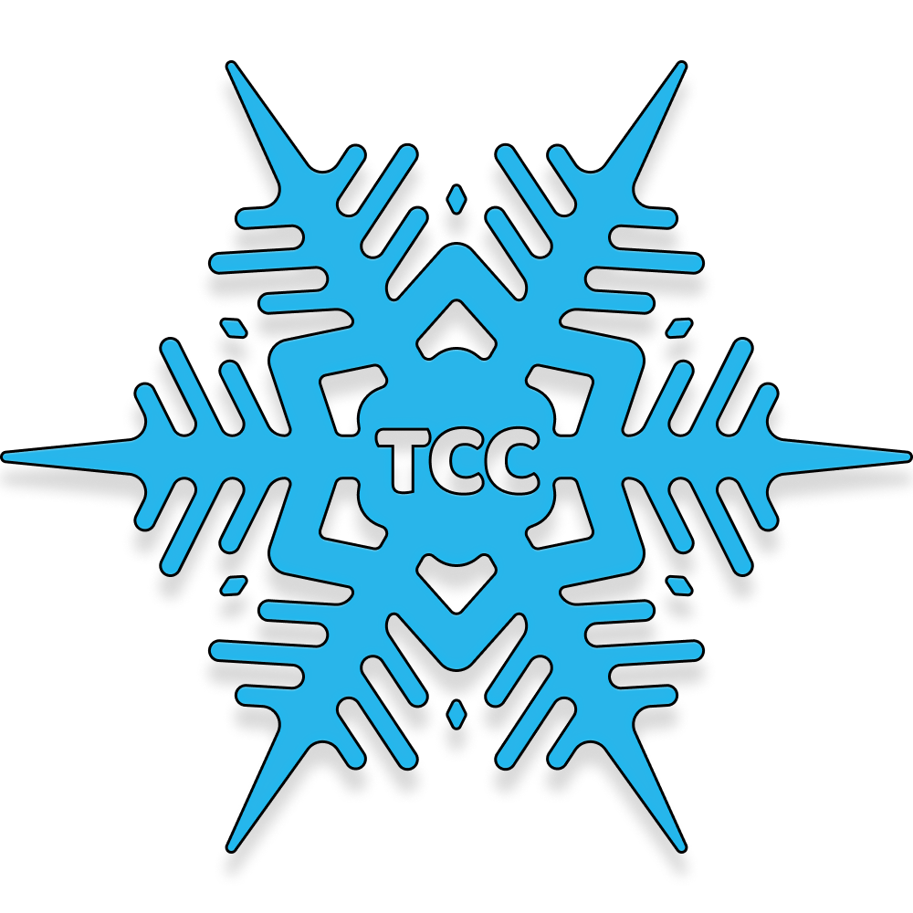

<p align="center">
  
</p>
<h1 align="center">The Chill Chamber</h1>

**The Chill Chamber** is an aircon reselling website created with [Next.js](https://nextjs.org/) - [PostgreSQL](https://www.pgsclusters.com/pgs-tutorials/).

## How to use
*Note: Make sure you have a [Node.js](https://nodejs.org/en/) installed. To check, run `node -v` in your terminal*

1. First clone this git repository to your local device
```
git clone https://github.com/Pilner/The-Chill-Chamber.git
cd The-Chill-Chamber
```
2. Download all the dependencies and packages needed in this repository
```
npm install
```
3. Create an .env.local file and fill up environment variables
```
touch .env.local
```
4. Run the program
```
npm run dev
```
5. View the website on browser at
```
localhost:3000
```


## Collaborators

- Fabian Railey A. Victuelles
- Jose Ezra Nazarene B. Vergabera

## Support

You can donate to us through our GCash accounts. Your donations would greatly help us in our studies.

**Fabian Railey A. Victuelles (Full-Stack Developer)**


&nbsp;

**Jose Ezra Nazarene B. Vergabera (Web Designer)**


## Licenses

MIT License

Copyright (c) 2023 Vergabera, Victuelles

Permission is hereby granted, free of charge, to any person obtaining a copy of this software and associated documentation files (the "Software"), to deal in the Software without restriction, including without limitation the rights to use, copy, modify, merge, publish, distribute, sublicense, and/or sell copies of the Software, and to permit persons to whom the Software is furnished to do so, subject to the following conditions:

The above copyright notice and this permission notice shall be included in all copies or substantial portions of the Software.

THE SOFTWARE IS PROVIDED "AS IS", WITHOUT WARRANTY OF ANY KIND, EXPRESS OR IMPLIED, INCLUDING BUT NOT LIMITED TO THE WARRANTIES OF MERCHANTABILITY, FITNESS FOR A PARTICULAR PURPOSE AND NONINFRINGEMENT. IN NO EVENT SHALL THE AUTHORS OR COPYRIGHT HOLDERS BE LIABLE FOR ANY CLAIM, DAMAGES OR OTHER LIABILITY, WHETHER IN AN ACTION OF CONTRACT, TORT OR OTHERWISE, ARISING FROM, OUT OF OR IN CONNECTION WITH THE SOFTWARE OR THE USE OR OTHER DEALINGS IN THE SOFTWARE.

